# AS-Okta-NetworkZoneUpdate-HTTP

Author: Accelerynt

For any technical questions, please contact info@accelerynt.com  

       

This playbook is intended to be run from the AS-IAM-Master-Playbook. It will add the IP address from Microsoft Sentinel Incidents to an Okta Network Zone of your choosing.

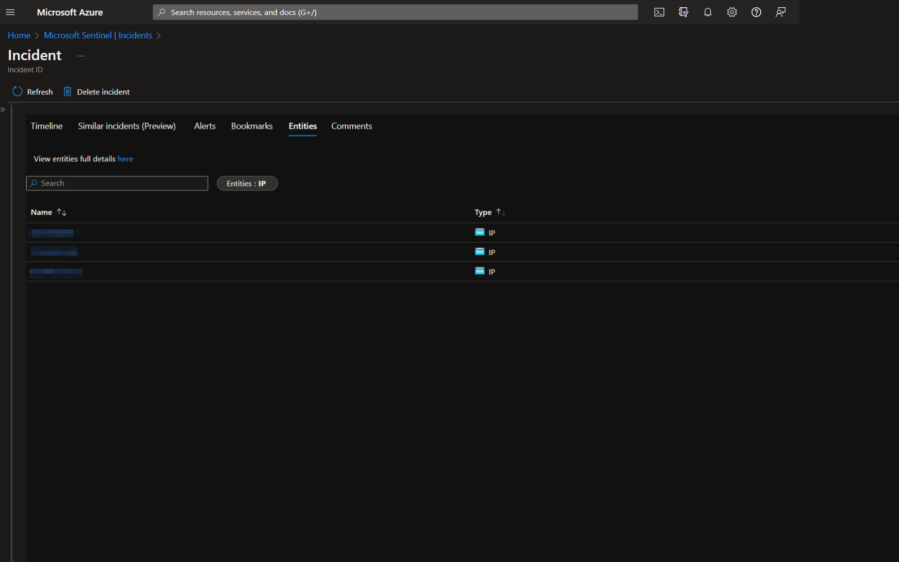

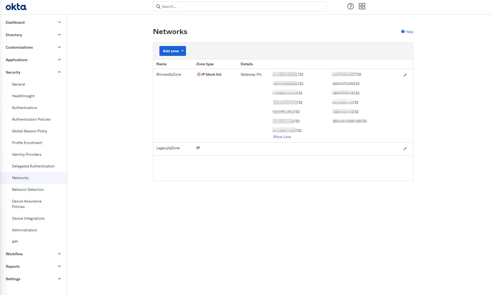

#
### Requirements

The following items are required under the template settings during deployment: 

* An Okta Admin account and [API token](https://developer.okta.com/docs/guides/create-an-api-token/main/)
* An Okta [Network Zone](https://help.okta.com/en-us/Content/Topics/Security/network/network-zones.htm) to add IPs to
* An [Azure Key Vault Secret](https://github.com/Accelerynt-Security/AS-IAM-Master-Playbook/tree/main/AS-Okta-NetworkZoneUpdate-HTTP#create-an-azure-key-vault-secret) containing your Okta API Token 

# 
### Setup

#### Create an Azure Key Vault Secret:

Navigate to the Azure Key Vaults page: https://portal.azure.com/#view/HubsExtension/BrowseResource/resourceType/Microsoft.KeyVault%2Fvaults

Navigate to an existing Key Vault or create a new one. From the Key Vault overview page, click the "**Secrets**" menu option, found under the "**Settings**" section. Click "**Generate/Import**".

Choose a name for the secret, such as "**AS-Okta-NetworkZoneUpdate-HTTP-API-Token**", and enter the Okta API Token copied previously in the "**Value**" field. All other settings can be left as is. Click "**Create**". 

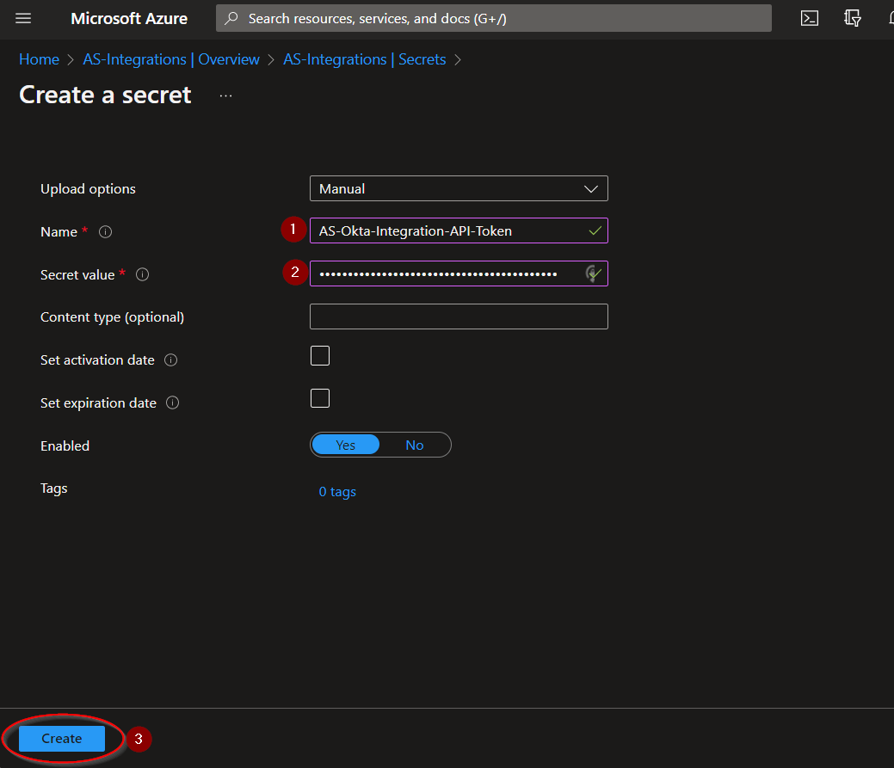

Once your secret has been added to the vault, navigate to the "**Access policies**" menu option, also found under the "**Settings**" section on the Key Vault page menu. Leave this page open, as you will need to return to it once the playbook has been deployed. See [Granting Access to Azure Key Vault](https://github.com/Accelerynt-Security/AS-IAM-Master-Playbook/tree/main/AS-Okta-NetworkZoneUpdate-HTTP#granting-access-to-azure-key-vault).

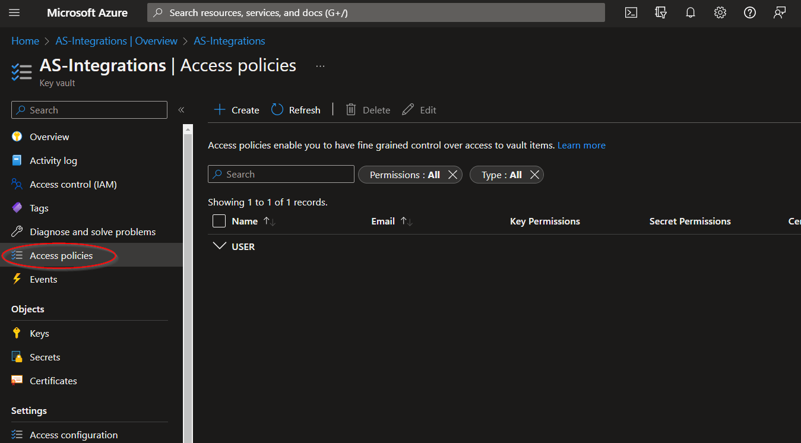

#
### Deployment                                                                                                         
                                                                                                        
To configure and deploy this playbook:
 
Open your browser and ensure you are logged into your Microsoft Sentinel workspace. In a separate tab, open the link to our playbook on the Accelerynt Security GitHub Repository:

https://github.com/Accelerynt-Security/AS-Okta-NetworkZoneUpdate-HTTP

                                             

Click the “**Deploy to Azure**” button at the bottom and it will bring you to the custom deployment template.

In the **Project Details** section:

* Select the “**Subscription**” and “**Resource Group**” from the dropdown boxes you would like the playbook deployed to.  

In the **Instance Details** section:   

* **Playbook Name**: This can be left as "**AS-Okta-NetworkZoneUpdate-HTTP**" or you may change it.  

* **Okta Subdomain**: Enter the name of the subdomain (tenant) in the Okta Org URL. For example, with the URL https://example-admin.okta.com/, "**example-admin**" would be entered here.

* **Okta Network Zone**: Enter the name of the Okta Network Zone that the Microsoft Sentinel Incident IP addresses should be added to. It should be noted IPs are only accepted in a CIDR range notation. Individual IPs processed by this playbook will have a "**/32**" appended to them to fit this format.

* **Key Vault Name**: Enter the name of the Key Vault referenced in [Create an Azure Key Vault Secret](https://github.com/Accelerynt-Security/AS-IAM-Master-Playbook/tree/main/AS-Okta-NetworkZoneUpdate-HTTP#create-an-azure-key-vault-secret).

* **Secret Name**: Enter the name of the Key Vault Secret created in [Create an Azure Key Vault Secret](https://github.com/Accelerynt-Security/AS-IAM-Master-Playbook/tree/main/AS-Okta-NetworkZoneUpdate-HTTP#create-an-azure-key-vault-secret).

Towards the bottom, click on “**Review + create**”. 

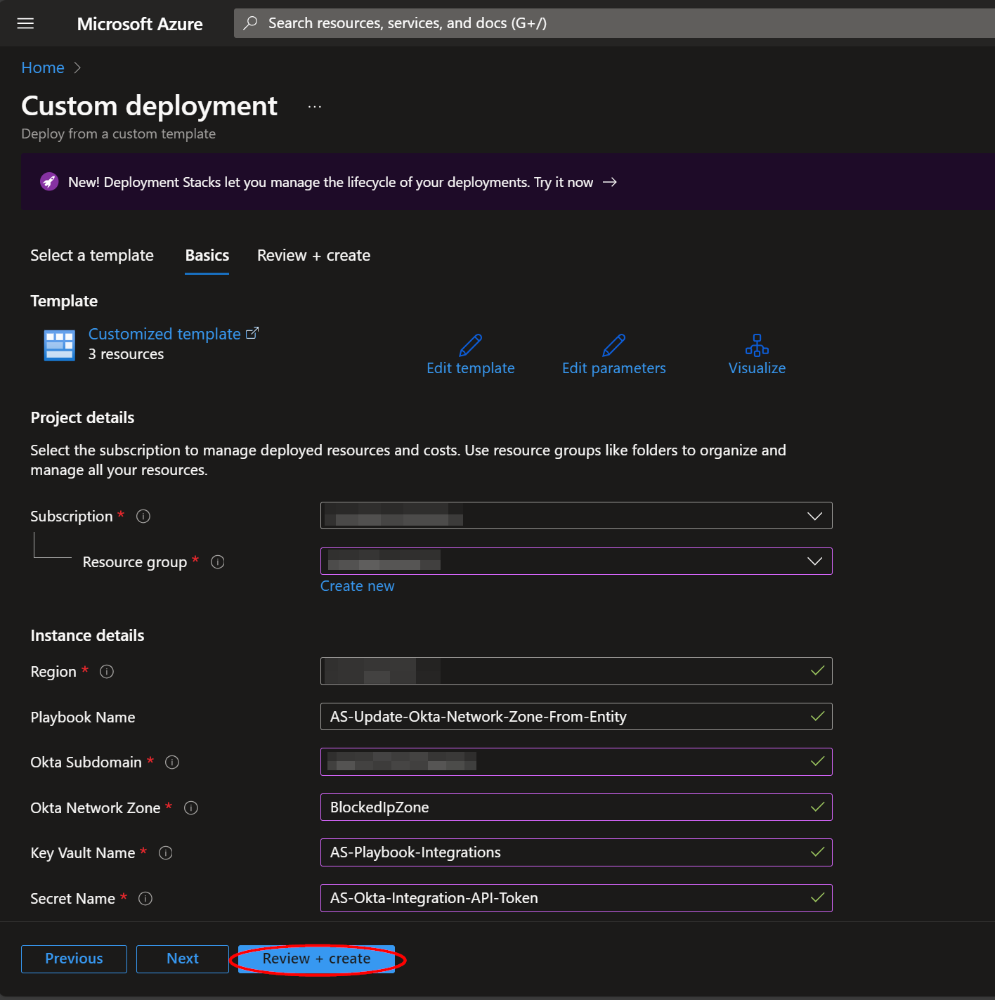

Once the resources have validated, click on "**Create**".

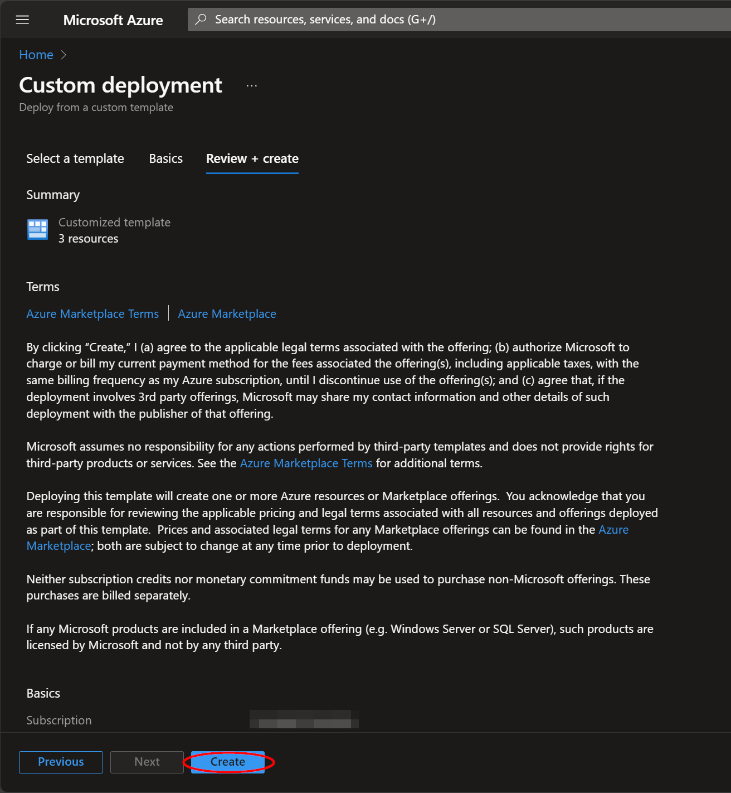

The resources should take around a minute to deploy. Once the deployment is complete, you can expand the "Deployment details" section to view them. To view the deployed Logic App, click the resource that corresponds to it.

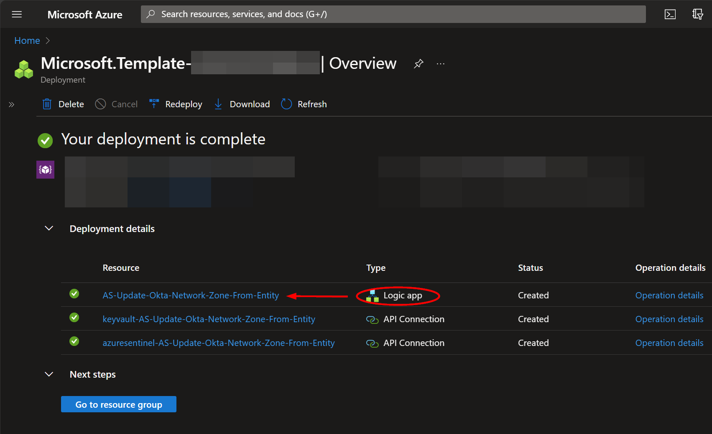

#
### Granting Access to Azure Key Vault

Before the Logic App can run successfully, the Key Vault connection created during deployment must be granted access to the Key Vault storing your Okta API Token.

From the Key Vault "**Access policies**" page, click "**Create**".

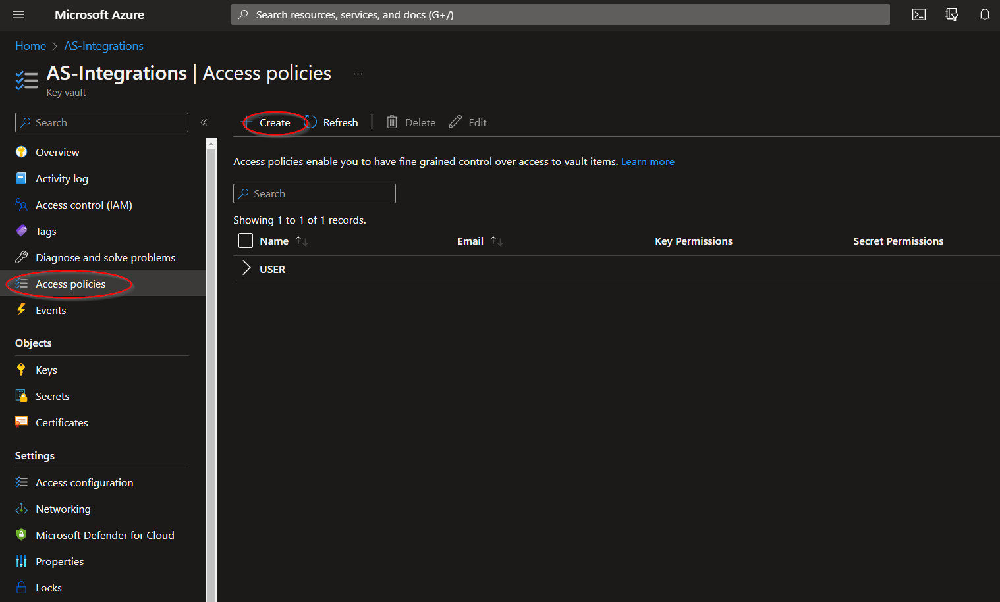

Select the "**Get**" checkbox under "**Secret permissions**", then click "**Next**".

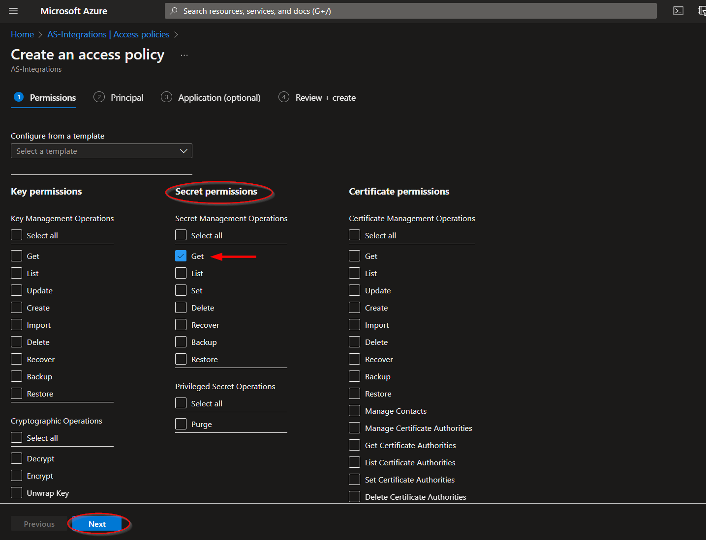

Paste "**AS-Okta-NetworkZoneUpdate-HTTP**" into the principal search box and click the option that appears. Click "**Next**" towards the bottom of the page.

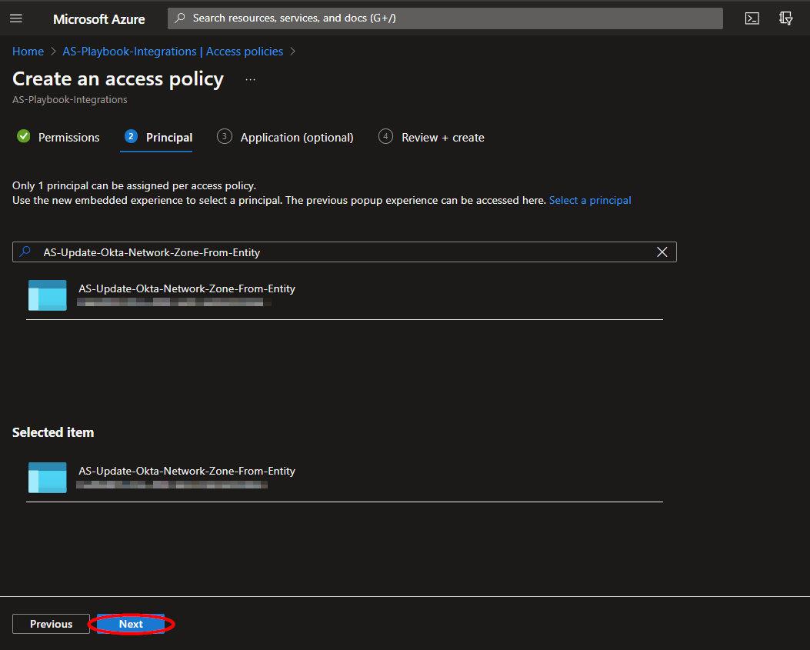

Navigate to the "**Review + create**" section and click "**Create**".

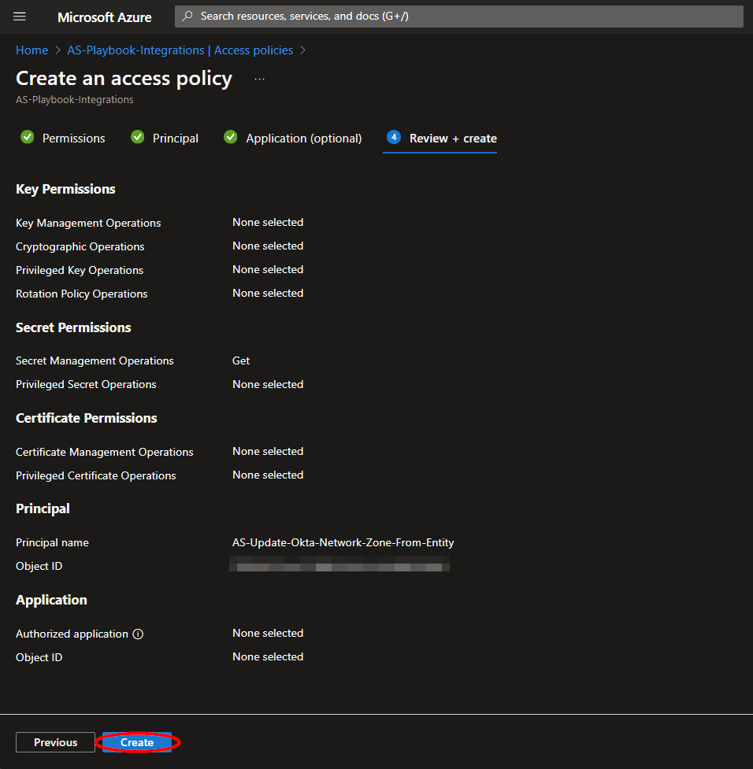

#
### Microsoft Sentinel Contributor Role

After deployment, you will need to give the system assigned managed identity the "**Microsoft Sentinel Contributor**" role. This will enable the Logic App to add comments to Incidents. Navigate to the Log Analytics Workspaces page and select the same workspace the playbook is located in:

https://portal.azure.com/#view/HubsExtension/BrowseResource/resourceType/Microsoft.OperationalInsights%2Fworkspaces

Select the "**Access control (IAM)**" option from the menu blade, then click "**Add role assignment**".

Select the "**Microsoft Sentinel Contributor**" role, then click "**Next**".

Select the "**Managed identity**" option, then click "**Select Members**". Under the subscription the Logic App is located, set the value of "**Managed identity**" to "**Logic app**". Next, enter "**AS-Okta-NetworkZoneUpdate-HTTP**", or the alternative playbook name used during deployment, in the field labeled "**Select**". Select the playbook, then click "**Select**".

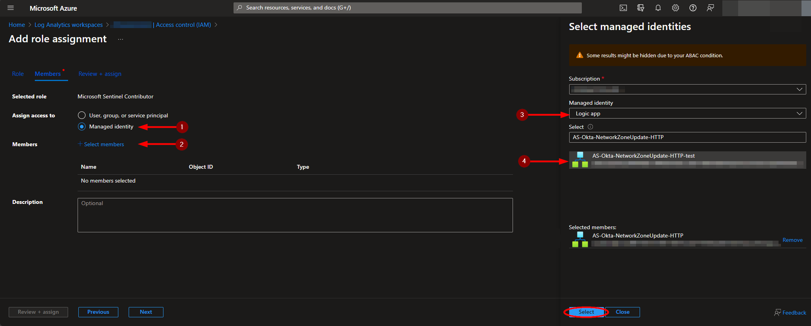

Continue on to the "**Review + assign**" tab and click "**Review + assign**".

